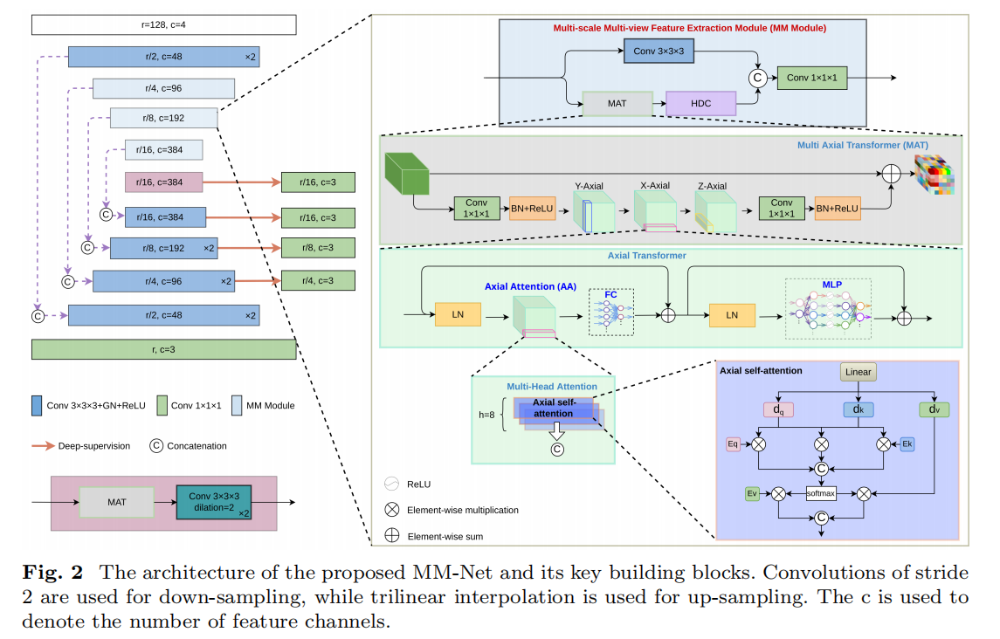

# MM-Net: Accurate Tumor Segmentation from Medical Images with Lightweight Hybrid Transformers

This repository contains the implementation of **MM-Net**, a novel lightweight hybrid transformer-based network for accurate tumor segmentation across various medical imaging modalities.

## Overview

* **Model:** MM-Net (EquiUnet by default)
* **Applications:** Brain tumor segmentation (e.g., BraTS datasets)
* **Features:**

  * Hybrid CNN-Transformer architecture for efficient global and local feature learning
  * Lightweight design with reduced parameters and FLOPs
  * Supports multi-model ensemble via TTA (Test-Time Augmentation)

## Pretrained Weights

We provide pretrained model weights to help you get started quickly:

> **Baidu Netdisk 下载链接**: [https://pan.baidu.com/s/1I0k1fVqV7rOPBzcArRzj8A](https://pan.baidu.com/s/1I0k1fVqV7rOPBzcArRzj8A)
> 提取码: `1a5s`

{: .notice--info}
**Note:** Download the archive and extract the `.pth.tar` files into a folder named `pretrained_weights` at the root of this repository.

## Installation

1. Clone this repository:

   ```bash
   git clone https://github.com/yourusername/MM-Net.git
   cd MM-Net
   ```
2. Set up a Python environment (recommended: conda):

   ```bash
   conda create -n mmnet python=3.8
   conda activate mmnet
   pip install -r requirements.txt
   ```

## Dataset Setup

By default, the data paths are specified in `src/config.py`. You can either edit this file:

```python
BRATS_TRAIN_FOLDERS = "/path/to/brats2020/MICCAI_BraTS_2020_Data_Training"
BRATS_VAL_FOLDER    = "/path/to/brats2020/MICCAI_BraTS_2020_Data_Validation"
BRATS_TEST_FOLDER   = "/path/to/brats2020/MICCAI_BraTS_2020_Data_Testing"
```

or set them as environment variables:

```bash
export BRATS_TRAIN_FOLDERS=/path/to/brats2020/MICCAI_BraTS_2020_Data_Training
export BRATS_VAL_FOLDER=/path/to/brats2020/MICCAI_BraTS_2020_Data_Validation
export BRATS_TEST_FOLDER=/path/to/brats2020/MICCAI_BraTS_2020_Data_Testing
```

## Training

To start training, run:

```bash
python -m src.train_trans --devices 0 --width 48 --arch EquiUnet
```

For more options:

```bash
python -m src.train_trans -h
```

After training, a `runs/` directory will be created with subfolders for each run:

```
runs/
└── 20201127_34335135__fold_etc/
    ├── 20201127_34335135__fold_etc.yaml         # Configuration used
    ├── segs/                                   # Generated .nii.gz segmentation files
    ├── model.txt                               # Model architecture summary
    ├── model_best.pth.tar                      # Best checkpoint weights
    └── patients_indiv_perf.csv                 # Per-patient performance log
```

## Inference

Use the `inference_Axial.py` script to perform validation or testing inference:

```bash
python -m src.inference_Axial -h
```

**Usage:**

```bash
python -m src.inference_Axial \
  --config path/to/config1.yaml path/to/config2.yaml \
  --devices 0 \
  --on val \
  [--tta] \
  [--seed 42]
```

* `--config`: One or more trained model YAML configs
* `--devices`: CUDA device IDs (e.g., `0,1`)
* `--on`: Dataset split: `val`, `train`, or `test`
* `--tta`: Enable Test-Time Augmentation (averaging multiple predictions)
* `--seed`: Random seed for reproducibility

## Model Architecture

The following diagram illustrates the MM-Net architecture, showing the integration of convolutional blocks and lightweight transformer modules:



## Experimental Results

Below are example segmentation results on the BraTS validation set, highlighting tumor core, enhancing tumor, and whole tumor predictions:


## License

This project is licensed under the MIT License. See the [LICENSE](LICENSE) file for details.

