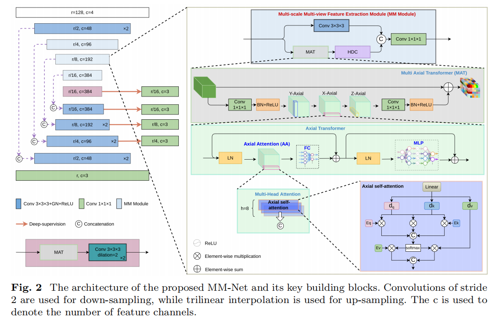
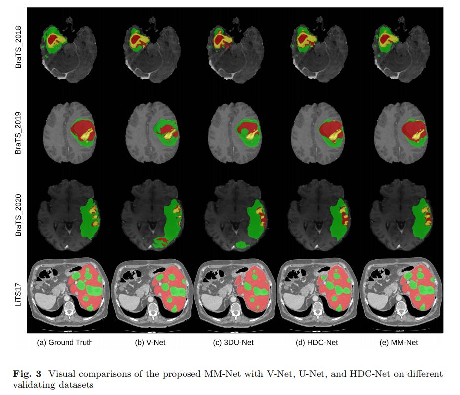

# MM-Net: Accurate Tumor Segmentation from Medical Images with Lightweight Hybrid Transformers

This repository contains an implementation of **MM-Net: Accurate Tumor Segmentation from Medical Images with Lightweight Hybrid Transformers**

## Installation

  We train and test our models under ```python=3.7.3,pytorch=1.6.0,cuda=9.2```. 

   1. Clone this repo
   ```sh
   git https://github.com/Aeagen/MM-Net.git
   cd MM-Net
   ```
   2. Set up a Python environment (recommended: conda):
   
   ```bash
   conda create -n mmnet python
   conda activate mmnet
   ```

   3. Install Pytorch and torchvision

   Follow the instruction on https://pytorch.org/get-started/locally/.
   ```sh
   # an example:
   conda install -c pytorch pytorch torchvision
   ```

   4. Install other needed packages
   ```sh
   pip install -r requirements.txt
   ```

## Data


Please download the corresponding datasets from the following links and organize the files as follows:

- [BraTS 2018 Dataset](https://www.med.upenn.edu/sbia/brats2018/registration.html)
- [BraTS 2019 Dataset](https://www.med.upenn.edu/cbica/brats2019/registration.html)
- [BraTS 2020 Dataset](https://www.med.upenn.edu/cbica/brats2020/registration.html)

For all three datasets, organize the files like this:
```
BraTS2018/
  ├── train/
  │   ├── Brats18_2013_2_1
  │   │   ├── Brats18_2013_2_1_flair.nii.gz
  │   │   ├── Brats18_2013_2_1_seg.nii.gz
  │   │   ├── Brats18_2013_2_1_t1.nii.gz
  │   │   ├── Brats18_2013_2_1_t1ce.nii.gz
  │   │   ├── Brats18_2013_2_1_t2.nii.gz
  │   ├── Brats18_2013_3_1
  │   ├── Brats18_2013_4_1
  │   ├── ...
  ├── valid/
```


## config Setup

By default, the data paths are specified in `src/config.py`. You can either edit this file:

```python
BRATS_TRAIN_FOLDERS = "/path/to/brats2020/MICCAI_BraTS_2020_Data_Training"
BRATS_VAL_FOLDER    = "/path/to/brats2020/MICCAI_BraTS_2020_Data_Validation"
BRATS_TEST_FOLDER   = "/path/to/brats2020/MICCAI_BraTS_2020_Data_Testing"
```

or set them as environment variables:

```bash
export BRATS_TRAIN_FOLDERS=/path/to/brats2020/MICCAI_BraTS_2020_Data_Training
export BRATS_VAL_FOLDER=/path/to/brats2020/MICCAI_BraTS_2020_Data_Validation
export BRATS_TEST_FOLDER=/path/to/brats2020/MICCAI_BraTS_2020_Data_Testing
```


## Run

### 1. Eval our pretrianed models
  Download our MM-Net model checkpoint "checkpoint.pth" from 
  
  > **Baidu Netdisk 下载链接**: [https://pan.baidu.com/s/1I0k1fVqV7rOPBzcArRz8A](https://pan.baidu.com/s/1I0k1fVqV7rOPBzcArRz8A)
  > 提取码: `1a5s`
  
  ```bash
  python -m src.inference_Axial -h
  ```
  
  **Usage:**
  
  ```bash
  python -m src.inference_Axial \
    --config path/to/config1.yaml path/to/config2.yaml \
    --devices 0 \
    --on val \
    [--tta] \
    [--seed 42]
  ```
  
  * `--config`: One or more trained model YAML configs
  * `--devices`: CUDA device IDs (e.g., `0,1`)
  * `--on`: Dataset split: `val`, `train`, or `test`
  * `--tta`: Enable Test-Time Augmentation (averaging multiple predictions)
  * `--seed`: Random seed for reproducibility


### 2. Train a model from scratch
To start training, run:

```bash
python -m src.train_trans --devices 0 --width 48 --arch EquiUnet
```

For more options:

```bash
python -m src.train_trans -h
```

After training, a `runs/` directory will be created with subfolders for each run:

```
runs/
└── 20201127_34335135__fold_etc/
    ├── 20201127_34335135__fold_etc.yaml         # Configuration used
    ├── segs/                                   # Generated .nii.gz segmentation files
    ├── model.txt                               # Model architecture summary
    ├── model_best.pth.tar                      # Best checkpoint weights
    └── patients_indiv_perf.csv                 # Per-patient performance log
```


## Model Architecture

The following diagram illustrates the MM-Net architecture:



## Experimental Results

Below are example segmentation results:




